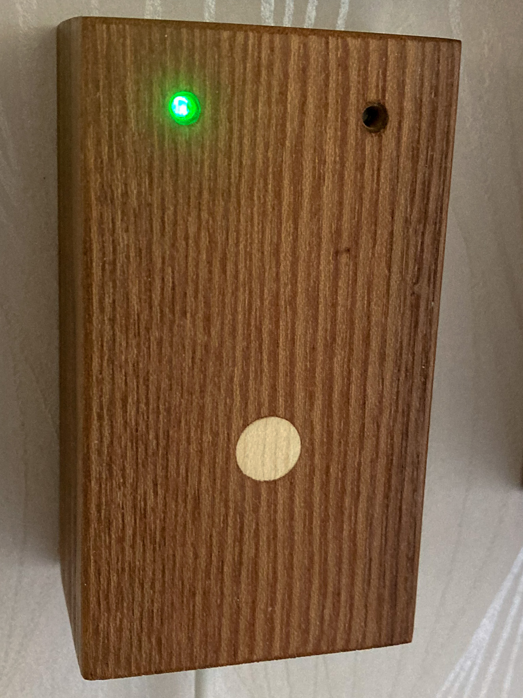

# NFC-Alarm-Panel
ESPHOME based NCF reader for controlling Alarm in Home Assistant

The tag reader is a build using use NFC tag reader for enabling and disabling an Alarm and is created for [Home Assistant](https://www.home-assistant.io). It is using an ESP 8266 and the RC522 NFC module. The firmware is built using [ESPhome](https://www.esphome.io).

---

---
### To build the reader you need:
 - ESP8266
 - RC522 NFC reader
 - WS2812 LED
 - Buzzer
 - 2N2222 NPN transistor or similar
 - 2K resistor
